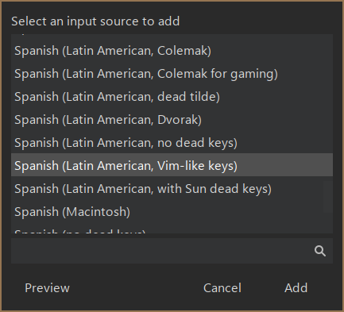

# Vim-like XKB/xmodmap configuration

`xmodmap` configuration files (`*.lst`) are easier to read and maintain than
`xkb` files, this is the reason most customized keyboard layout configurations
are shared as `lst` files.
But loading layouts from `xmodmap` config files is really slow, and `xkb` can do
the same job almost immediately.

This repository stores the `xmodmap` and `xkb` configuration files I made to
remap some of the keys on my keyboard to keys near the home row, along with
detailed instructions on how to convert from an `xmodmap` `*.lst` configuration
file to a system-wide `xkb` layout.

- [Vim-like XKB/xmodmap configuration](#vim-like-xkbxmodmap-configuration)
  - [Which keys do I remap?](#which-keys-do-i-remap)
  - [Convert `xmodmap` to `xkb` files](#convert-xmodmap-to-xkb-files)
  - [Create a new custom layout](#create-a-new-custom-layout)
    - [Set the layout as a variant for the base one](#set-the-layout-as-a-variant-for-the-base-one)
    - [Make the layout the default one](#make-the-layout-the-default-one)

## Which keys do I remap?
The following pictures give a good insight of the custom layout I use, the first
one shows the default layout and the second one shows the one I use. I basically
added vim-like keys (arrows, <kbd>Home</kbd><kbd>End</kbd> and
<kbd>Esc</kbd>:<kbd>Caps Lock</kbd> swap), media keys (play/pause, previous/next
track) and a numeric pad.

Overridden keys are shown in blue, while hidden keys are shown in red; the hidden
keys are accessible by using <kbd>AltGr</kbd> as the modifier key.


- **Note**: If you're already using a Latin American keyboard, you may want to
go ahead and test my custom layout by running the following script, will prompt you
for your password to save the generated xkb layout into the system (it may take
a minute or so):

    ```language
    ./xmodmap-to-xkb-layout.sh
    ```

    Keep reading to do this manually or with other base layouts.

## Convert `xmodmap` to `xkb` files

Replace each occurrence of `latam` from all steps with the name of the layout
your custom layout is based upon.

You can see the complete list of layouts with:
```sh
sed '/^! layout$/, /^ *$/!d; //d' /usr/share/X11/xkb/rules/base.lst
```

1. Install xkb utilities
   ```sh
   sudo apt install x11-xkb-utils
   ```
   
1. Restore the default configuration.
    ```sh
    setxkbmap -option && setxkbmap latam
    ```

1. Backup the default layout.
    ```sh
    xmodmap -pke > xmodmap/xmodmap_latam_defaults.lst
    xkbcomp -xkb $DISPLAY xkb/latam_defaults.xkb
    ```

1. Apply your custom `xmodmap` file after any extra mappings, for example, I
    swap <kbd>Esc</kbd> with <kbd>Caps Lock<kb>. This may take a minute.
    ```sh
    setxkbmap -option caps:swapescape
    xmodmap xmodmap/xmodmap_latam_customs.lst
    ```

1. Get the keymap you just applied but with `XKB`.
    ```sh
    xkbcomp -xkb $DISPLAY xkb/latam_custom.xkb
    ```

1. Restore the default configuration, again.
    ```sh
    setxkbmap -option && setxkbmap latam
    ```

1. Test/apply the custom generated `xkb` file.
    ```sh
    xkbcomp -w0 xkb/latam_custom.xkb $DISPLAY
    ```

1. Then you can use the previous command (with absolute path) on a startup script to apply your custom keymap on login.

## Create a new custom layout
You can further convert your custom `xkb` file into an `xkb symbols` file to let `XKB` recognize it as a new layout.

1. Get the symbols portion of the complete `xkb` file.
    ```sh
    sed -n '/^xkb_symbols/, /^xkb_/p' xkb/latam_custom.xkb | head -n-1 > xkb/latam_custom_symbols.xkb
    ```

1. Open `xkb/latam_custom_symbols.xkb` and rearrange the header from:
    ```txt
    xkb_symbols "pc+latam+inet(evdev)" {
    ```
    To:
    ```txt
    xkb_symbols "latam_custom" {
        include "pc+latam+inet(evdev)"
    ```
    
1. Create a link to the symbols file into the xkb config folder:
    ```sh
    sudo ln -srf xkb/latam_custom_symbols.xkb /usr/share/X11/xkb/symbols/latam_custom
    ```
    
1. Restore the default configuration, again.
    ```sh
    setxkbmap -option && setxkbmap latam
    ```

1. Then you can run `setxkbmap latam_custom` to apply the new layout.

### Set the layout as a variant for the base one
You can go even further and convert your custom `xkb` layout into a variant of
the layout it's based on.

- Open `/usr/share/X11/xkb/symbols/latam` and add the following snippet to the
bottom of the file:
    ```perl
    partial alphanumeric_keys
    xkb_symbols "vimlikekeys" {
        include "latam_custom"
        name[Group1]="Spanish (Latin American, Vim-like keys)";
    };
    ```

Now you can just run `setxkbmap latam vimlikekeys` to apply the layout custom,
of follow the next step to make the layout available in the Keyboard settings
of your Desktop Environment.

- Open `/usr/share/X11/xkb/rules/evdev.xml` and add the following snippet
inside between tags `<varianList>` of the layout you based your custom
layout on, in my case, `latam`:
    ```xml
    <!-- ... -->
    <layout>
     <configItem>
         <name>latam</name>
         <shortDescription>es</shortDescription>
         <description>Spanish (Latin American)</description>
         <!-- ... -->
     </configItem>
     <variantList>
         <!-- Add this snippet: -->
         <variant>
         <configItem>
             <name>vimlikekeys</name>
             <description>Spanish (Latin American, Vim-like keys)</description>
         </configItem>
         </variant>
         <!-- End of snippet -->
         <!-- ... -->
     </variantList>
    <!-- ... -->
    </layout>
    ```

Then you will be able to select the layout it in the keyboard settings of the
Desktop Environment, `Cinnamon` in my case:




### Make the layout the default one

You can now apply the custom layout by running either `setxkbmap latam_custom`
or `setxkbmap latam vimlikekeys`, but newly plugged keyboards, TTYs, Display
Managers (logging screens), etc., will fallback to the default
layout. Follow the next steps to make the new custom layout the default
one.

1. Set the layout and variant of the keyboard in the system-wide configuration file.

    ```sh
    echo -n '
    XKBLAYOUT="latam"
    XKBVARIANT="vimlikekeys"
    ' | sudo tee -a /etc/default/keyboard
    ```

2. Reboot to apply the changes system-wide.


*Note:* This works for debian-based distros.
