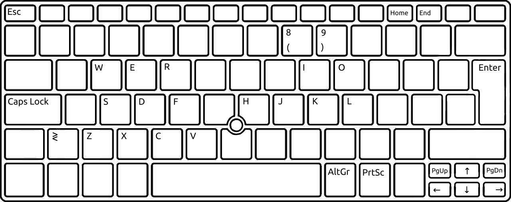
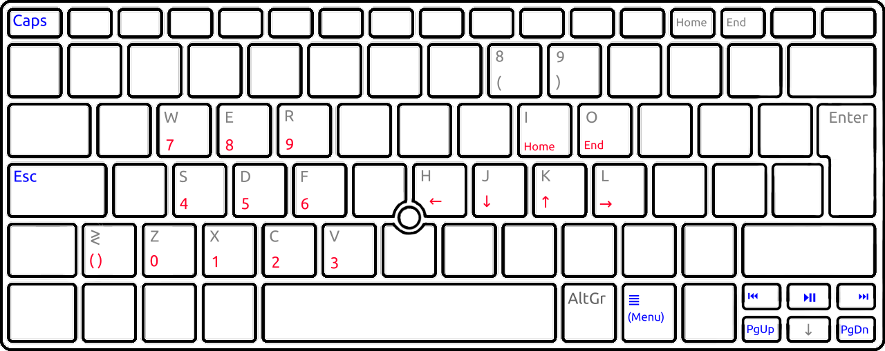

# Vim-like XKB/xmodmap configuration

This repository stores the `xmodmap` and `XKB` configuration files I use to remap some of the keys on my keyboard to keys near the home row, along with basic instructions on how to convert from an `xmodmap` to an `xkb` file.

- [Which keys do I remap?"](#which-keys-do-i-remap)
- [Convert `xmodmap` to `xkb` files](#convert-xmodmap-to-xkb-files)
  - [Create a new layout](#create-a-new-layout)

## Which keys do I remap?"
The following pictures give a good insight of the keymap I use, the first one shows the default layout and the second one shows the one I use. Basically, added vim-like keys (arrows, <kbd>Home</kbd><kbd>End</kbd> and <kbd>Esc</kbd>:<kbd>Caps Lock</kbd> swap), media keys (play/pause, previous/next track) and a numeric pad.

Overriden keys are shown in blue, while hidden keys are shown in red; the hidden keys are accessible by using <kbd>AltGr</kbd> as the modifier key.





## Convert `xmodmap` to `xkb` files

`xmodmap` files are easier to read than `xkb` files

**Note**: I use latam layout, If you use another layout, just change `latam` to the name of the one you use. You can see the complete list with:
```sh
sed '/^! layout$/, /^ *$/!d; //d' /usr/share/X11/xkb/rules/base.lst
```

1. Restore the default configuration.
    ```sh
    setxkbmap -option && setxkbmap latam
    ```

2. Backup the default layout.
    ```sh
    xmodmap -pke > xmodmap/xmodmap_latam_defaults.lst
    xkbcomp -xkb $DISPLAY xkb/latam_defaults.xkb
    ```

3. Apply your custom `xmodmap` file after any extra mappings, for example, I swap <kbd>Esc</kbd> with <kbd>Caps Lock<kb>
    ```sh
    setxkbmap -option caps:swapescape
    xmodmap xmodmap/xmodmap_latam_customs.lst
    ```

4. Get the keymap you just applied but with `XKB`.
    ```sh
    xkbcomp -xkb $DISPLAY xkb/latam_custom.xkb
    ```

5. Test/apply the `xkb` file.
    ```sh
    xkbcomp -w0 xkb/latam_custom.xkb $DISPLAY
    ```

6. Then you can use the previous command (with absolute path) on a startup script to apply your custom keymap on login.

### Create a new layout
You can further convert your custom `xkb` file into an `xkb symbols` file to let `XKB` recognize it as a new layout.

1. Get the symbols portion of the complete `xkb` file.
    ```sh
    sed -n '/^xkb_symbols/, /^xkb_/p' xkb/latam_custom.xkb | head -n -1 > xkb/latam_custom_symbols.xkb
    ```

2. Open `xkb/latam_custom_symbols.xkb` and rearrange the header from:
    ```txt
    xkb_symbols "pc+latam+inet(evdev)" {
    ```
    To:
    ```txt
    xkb_symbols "latam_custom" {
        include "pc+latam+inet(evdev)"
    ```
3. Create a link to the symbols file into the xkb config folder:
    ```sh
    ln -srf xkb/latam_custom_symbols.xkb /usr/share/X11/xkb/symbols/latam_custom
    ```
4. Then you can run `setxkbmap latam_custom` on startup.
